# Takes A Village
## **LINK HERE**

Everybody has skills, and nobody knows everything. Through community engagement and by sharing our skills, everybody can learn more and benefit. 'Takes A Village' is an app that brings people together into a community, where they can connect and get together to share their knowledge with one another. 

## Contents
<!-- START doctoc generated TOC please keep comment here to allow auto update -->
<!-- DON'T EDIT THIS SECTION, INSTEAD RE-RUN doctoc TO UPDATE -->
**Table of Contents**  *generated with [DocToc](https://github.com/thlorenz/doctoc)*

- [Problem](#problem)
- [Solution](#solution)
- [Trello Board](#trello-board)
  - [Main CANBAN](#main-canban)
  - [User Stories + Features](#user-stories--features)
- [User Stories](#user-stories)
  - [User Stories](#user-stories-1)
  - [User Journeys](#user-journeys)
- [Features](#features)
  - [Initial List](#initial-list)
  - ["Nice To Have"](#nice-to-have)
- [Entity Relationship Diagram](#entity-relationship-diagram)
- [Models](#models)
- [Inspiration / Pinterest](#inspiration--pinterest)
- [Wireframes / Figma](#wireframes--figma)
  - [Colours and Font](#colours-and-font)
  - [Mobile First](#mobile-first)
  - [Full Page App](#full-page-app)
- [Gems Used](#gems-used)
- [Anticipated Challenges](#anticipated-challenges)
- [Coding](#coding)
  - [Journey (Dated)](#journey-dated)
  - [Tools](#tools)
- [Additional Features](#additional-features)
- [Final Product](#final-product)
  - [Mobile](#mobile)
  - [Full Page App](#full-page-app-1)
- [Presentation Slides](#presentation-slides)

<!-- END doctoc generated TOC please keep comment here to allow auto update -->

## Problem

We often ask friends if they can teach us what they know, and we often get excited, happy responses and enthusiasm, but then we never catch up. It never eventuates. People want to learn, and people want to share what they know, but managing events and organising can be difficult for some, and finding and organising a group of friends to come along and learn can be hard.

## Solution

Takes A Village offers to solve this problem by creating a place for people to come together, talk about the things they love, and create small, simple events where somebody teaches others what they know. The site will have event style listings, set up quickly and easily, and allow for other users to join along if they like the idea. 

## User Stories
### * **LINK TO USER STORIES BOARD** *

The first stage of development was the user stories stage. I needed to come up with ways that the users might want to use my application, from various perspectives. I worked together with some classmates to help one another brainstorm ideas for user profiles and some ideas of user stories and journeys.

### User Profiles

To begin with we wrote up some (possibly over-detailed, though we got the advice from some reputable sources) user profiles for users we thought might use the app. I collated this info into some trello cards as so:

<a href="docs/user1.png" target="_blank">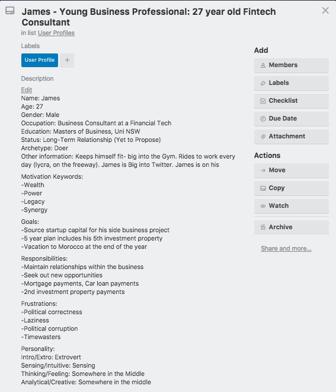</a> <a href="docs/user2.png" target="_blank">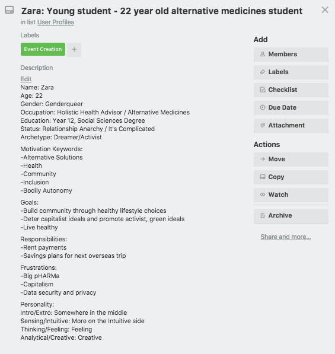</a> <a href="docs/user3.png" target="_blank">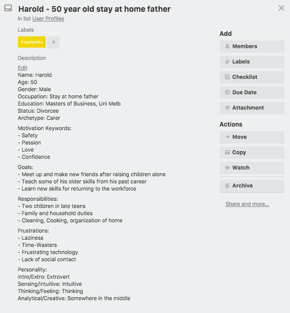</a>

These turned out to be less-than-useful for my purposes, as it was more imporant to focus on the **type** of user than the distinct personality. I feel like these personality profiles may help in a pitch, or design team setting, when more information or connection to the product is required- but less so for my design. 

<a href="docs/userstories1.png" target="_blank">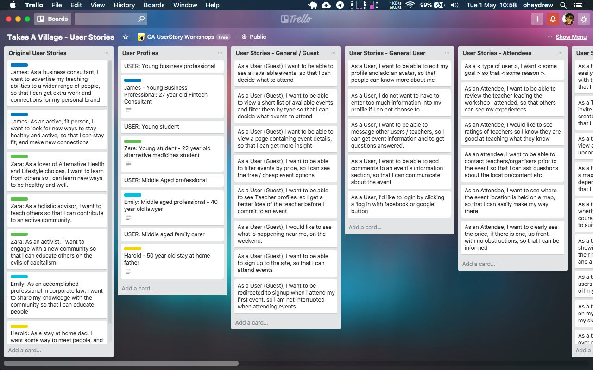</a>

### User Journeys

As such, I decided to work in the same small team to come up with five categories of user: *The General User*, *The Attendee*, *The Teacher*, *The Admin/Marketplace*, and *The Guest*. Each of these represent a user type, and have a different journey. This helped to flesh out required features, pages and models that I might require.

I loaded these users up into Trello lists, and used them to compile my initial features list.

<a href="docs/userstories2.png" target="_blank">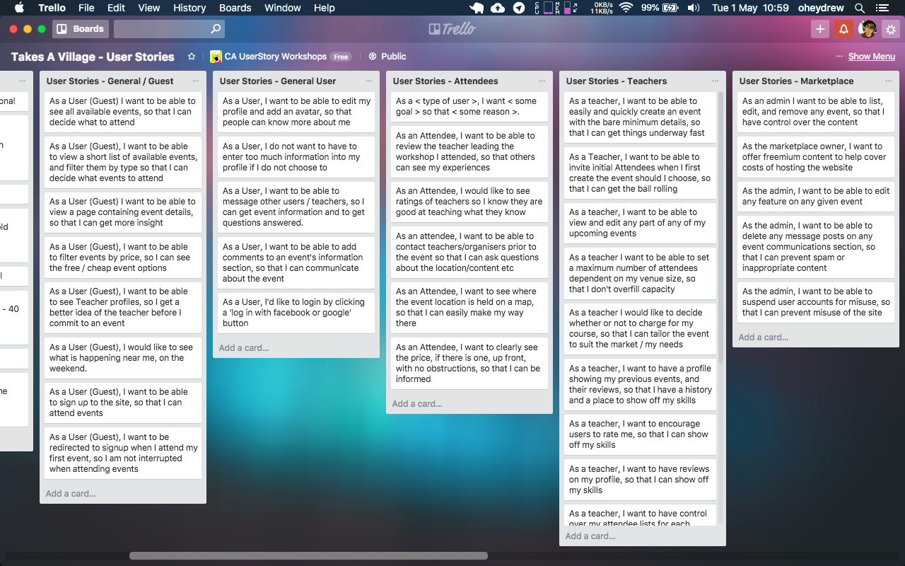</a>

## Trello Board
### Feature Compilation

From these User Stories I really got a feel for the features I might need- it was written right in front of me. I actually found more than I initially thought: There was a big need for messaging and communication that I didn't see before, and much more need and emphasis on filtering the events by many different category types. I started by compiling one large list of features, categorizing them by rough "page"/"model" category, and then splitting them into *"Need"*, *"Want*, and *"Nice To Have"*.

<a href="docs/features-userstories.png" target="_blank">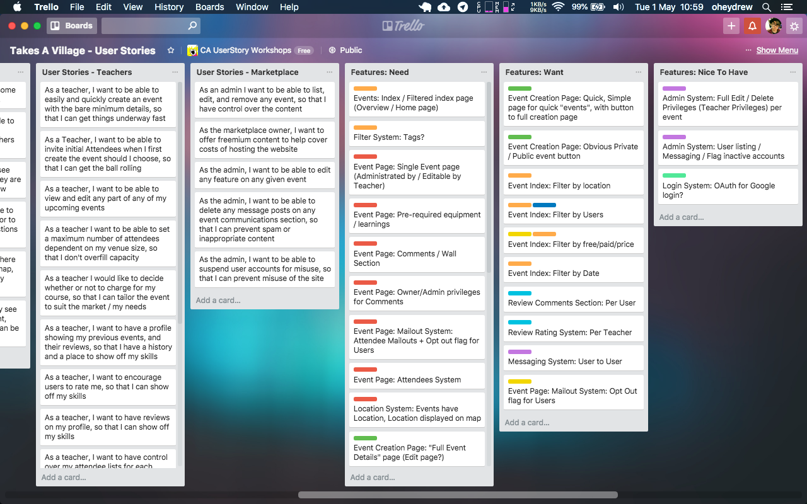</a>

### Main CANBAN
### * **LINK TO MAIN CANBAN BOARD** *

Now, it was time to move them into my main CANBAN board, a separate Trello board which held all my workflow. CANBAN helps me so much in staying focussed- and I also used [PomoDoneApp](https://www.pomodoneapp.com/) as a Pomodoro Timer that linked into my Trello cards.

<a href="docs/canban-1a.png" target="_blank">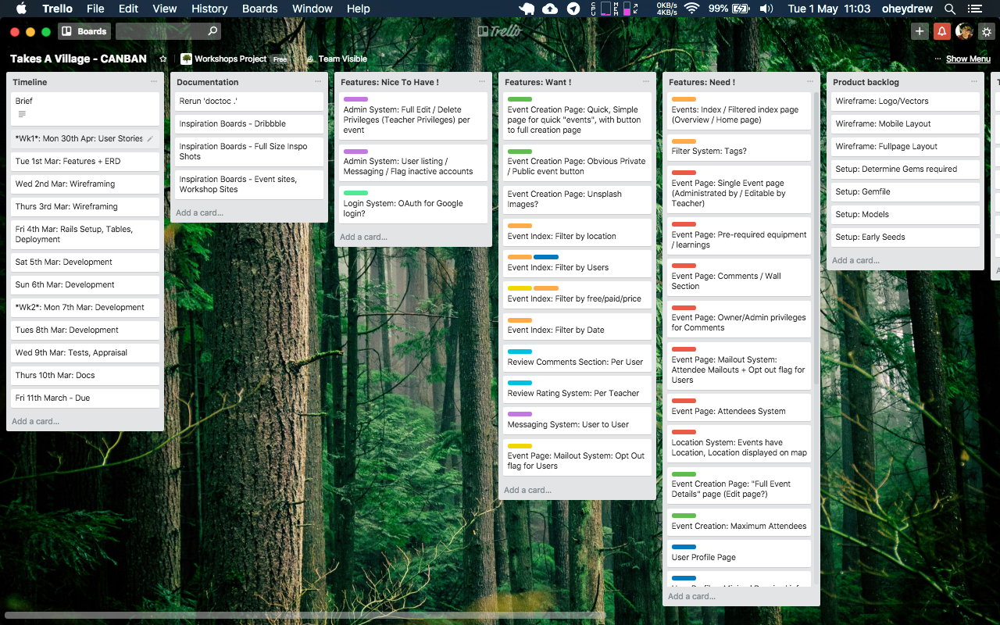</a>
<a href="docs/canban-1b.png" target="_blank">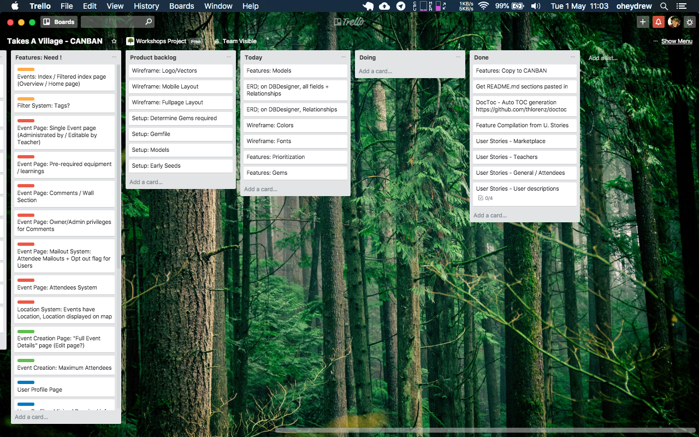</a>

I copied the feature list from the User Stories, to lay out the work in front of me. I also filled in my expected Timeline. Using [PomoDoneApp](https://www.pomodoneapp.com/) I was able to knock out small chunks of work and keep myself on-task.

## Features
### Initial List

### "Nice To Have"

## Entity Relationship Diagram

## Models

## Inspiration / Pinterest

I started off with a couple of simple searches for "green" and "blue" on design places such as [Dribbble](https://dribbble.com/oheydrew/buckets/695857-Takes-A-Village-Inspo):

<a href="https://dribbble.com/oheydrew/buckets/695857-Takes-A-Village-Inspo" target="_blank">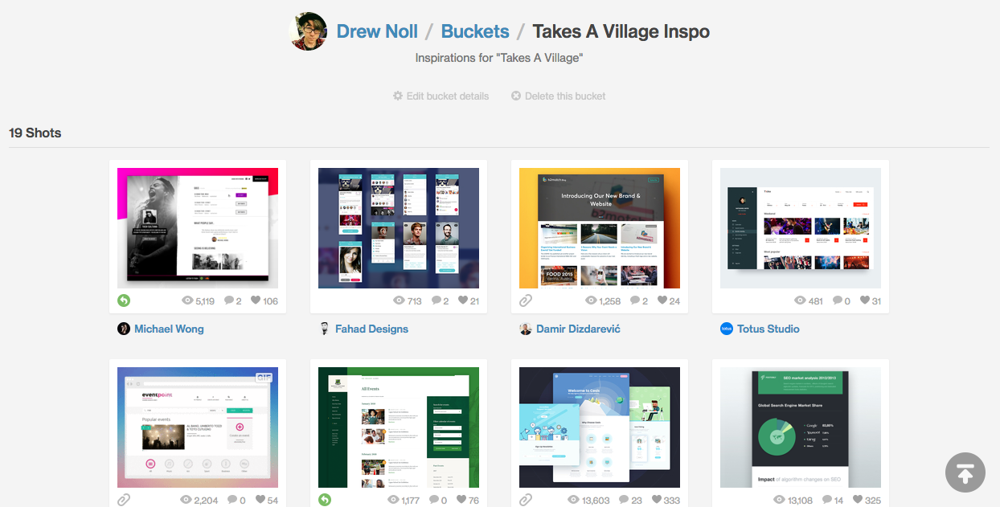</a>

...and [Pinterest](https://www.pinterest.com.au/oheydrew/takes-a-village-inspo/):

<a href="https://www.pinterest.com.au/oheydrew/takes-a-village-inspo/" target="_blank">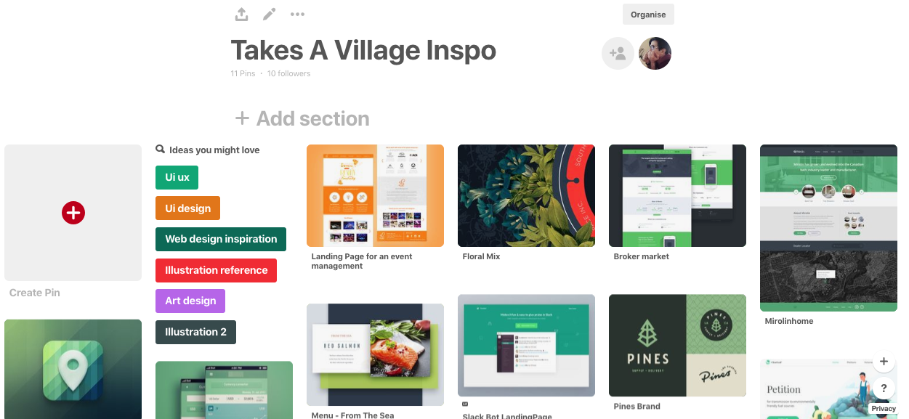</a>

I found myself drawn toward design themes with a white background, and a green or blue foundation colour. I also found my eye catching toward the blockier, more solid look of certain designs-

<a href="docs/inspo1.jpg" target="_blank">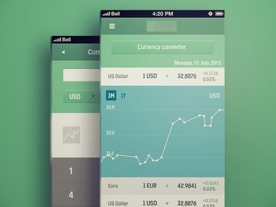</a> <a href="docs/inspo2.jpg" target="_blank">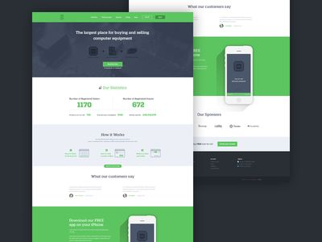</a> <a href="docs/inspo3.jpg" target="_blank">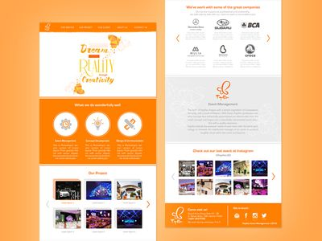</a> 

A bit more of a google, and some help from classmates led me to [Google Material Design](https://material.io/guidelines/#). It appears a lot of these looks come from this style. 

I went through and had a look at it's **3d design principles**, and **Paper design principles**
and drew a lot of inspiration. This led me to head back to Dribbble, and google "Material Design"

## Frontend Design: Wireframes / Figma
### Colours and Font

### Mobile First

### Full Page App

## Gems Used

## Anticipated Challenges

## Coding
### Journey (Dated)
### Tools

## Additional Features

## Final Product
### Mobile

### Full Page App

## Presentation Slides
