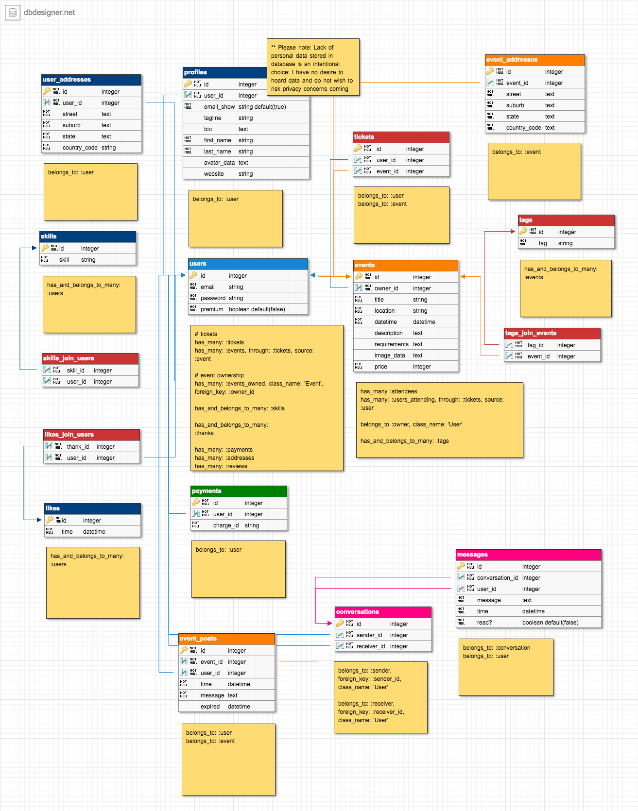
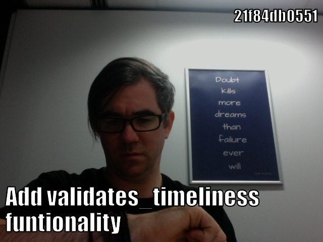

# Takes A Village
## [takesavillage-events.herokuapp.com/](https://takesavillage-events.herokuapp.com/)

Everybody has skills, and nobody knows everything. How many times have you been out with your friends, asked them "Hey, I'd love to learn that thing you know, can you teach me?" to have them enthusiastically respond; "Yes, of course!", only to forget to book something, lose track, and never actually have the little workshop session?

The creator of this app has experiences this, many times. I believe that through community engagement and by sharing our skills, everybody can learn more, and benefit. 

'Takes A Village' is an app that brings people together into a community, where they can connect and get together to share their knowledge with one another. 

## Contents
<!-- START doctoc generated TOC please keep comment here to allow auto update -->
<!-- DON'T EDIT THIS SECTION, INSTEAD RE-RUN doctoc TO UPDATE -->
**Table of Contents**  *generated with [DocToc](https://github.com/thlorenz/doctoc)*

- [Problem](#problem)
- [Solution](#solution)
- [Trello Board](#trello-board)
  - [Main CANBAN](#main-canban)
  - [User Stories + Features](#user-stories--features)
- [User Stories](#user-stories)
  - [User Stories](#user-stories-1)
  - [User Journeys](#user-journeys)
- [Features](#features)
  - [Initial List](#initial-list)
  - ["Nice To Have"](#nice-to-have)
- [Entity Relationship Diagram](#entity-relationship-diagram)
- [Models](#models)
- [Inspiration / Pinterest](#inspiration--pinterest)
- [Wireframes / Figma](#wireframes--figma)
  - [Colours and Font](#colours-and-font)
  - [Mobile First](#mobile-first)
  - [Full Page App](#full-page-app)
- [Gems Used](#gems-used)
- [Anticipated Challenges](#anticipated-challenges)
- [Coding](#coding)
  - [Journey (Dated)](#journey-dated)
  - [Tools](#tools)
- [Additional Features](#additional-features)
- [Final Product](#final-product)
  - [Mobile](#mobile)
  - [Full Page App](#full-page-app-1)
- [Presentation Slides](#presentation-slides)

<!-- END doctoc generated TOC please keep comment here to allow auto update -->

## Problem

We often ask friends if they can teach us what they know, and we often get excited, happy responses and enthusiasm, but then we never catch up. It never eventuates. People want to learn, and people want to share what they know, but managing events and organising can be difficult for some, and finding and organising a group of friends to come along and learn can be hard.

## Solution

Takes A Village offers to solve this problem by creating a place for people to come together, talk about the things they love, and create small, simple events where somebody teaches others what they know. The site will have event style listings, set up quickly and easily, and allow for other users to join along if they like the idea.

The concept is simple: The mobile app provides a quick, easy solution to one problem: We never get round to *making it happen*. Through a simple interface, and a lack of excessive data required, this app hopes to enable users to quickly and easily pull out their phone, organise to teach their friends something, and while they're at it, enables others to come along, should they choose to allow it.

Some key focuses of this app include:

- Fast, easy signup
- Quick, simple workshop (event) generation
- A default setting for a maximum 10 attendees, designed for small groups at heart
- Scalable options for the users to step up their event game, invite more people and even charge for admission (though, this would require a premium account)

### Business Plan

At it's heart, this app aims to be a community driven, grassroots "Get it done, teach one another" platform, not really for profit. Once users begin to heavily use the site, however, costs will no doubt be incurred, and so a simple "freemium" model is planned out. 

Free members can have quick, easy events created with a maximum of 10 attendees. This is at the heart of the grassroots, DIY ethos of the app and the community it means to serve.

Premium members will (when implemented) have the ability to hold larger events, with advanced planning features and mailouts, as well as charging ticket prices through the app.

## User Stories
### * **LINK TO USER STORIES BOARD** *

The first stage of development was the user stories stage. I needed to come up with ways that the users might want to use my application, from various perspectives. I worked together with some classmates to help one another brainstorm ideas for user profiles and some ideas of user stories and journeys.

### User Profiles

To begin with we wrote up some (possibly over-detailed, though we got the advice from some reputable sources) user profiles for users we thought might use the app. I collated this info into some trello cards as so:

<a href="docs/user1.png" target="_blank"></a> <a href="docs/user2.png" target="_blank"></a> <a href="docs/user3.png" target="_blank"></a>

These turned out to be less-than-useful for my purposes, as it was more imporant to focus on the **type** of user than the distinct personality. I feel like these personality profiles may help in a pitch, or design team setting, when more information or connection to the product is required- but less so for my design. 

<a href="docs/userstories1.png" target="_blank"></a>

### User Journeys

As such, I decided to work in the same small team to come up with five categories of user: *The General User*, *The Attendee*, *The Teacher*, *The Admin/Marketplace*, and *The Guest*. Each of these represent a user type, and have a different journey. This helped to flesh out required features, pages and models that I might require.

I loaded these users up into Trello lists, and used them to compile my initial features list.

<a href="docs/userstories2.png" target="_blank"></a>

## Trello Board
### Feature Compilation

From these User Stories I really got a feel for the features I might need- it was written right in front of me. I actually found more than I initially thought: There was a big need for messaging and communication that I didn't see before, and much more need and emphasis on filtering the events by many different category types. I started by compiling one large list of features, categorizing them by rough "page"/"model" category, and then splitting them into *"Need"*, *"Want*, and *"Nice To Have"*.

<a href="docs/features-userstories.png" target="_blank"></a>

### Main CANBAN
### * **LINK TO MAIN CANBAN BOARD** *

Now, it was time to move them into my main CANBAN board, a separate Trello board which held all my workflow. CANBAN helps me so much in staying focussed- and I also used [PomoDoneApp](https://www.pomodoneapp.com/) as a Pomodoro Timer that linked into my Trello cards.

<a href="docs/canban-1a.png" target="_blank"></a>
<a href="docs/canban-1b.png" target="_blank"></a>

I copied the feature list from the User Stories, to lay out the work in front of me. I also filled in my expected Timeline. Using [PomoDoneApp](https://www.pomodoneapp.com/) I was able to knock out small chunks of work and keep myself on-task.

## Features
### "Need"

Sorting things into "Need, Want, and Nice to Have" was difficult. I needed to strip back the app mentally into it's core functionality and what the users will NEED, most. I ended up with a longer list than expected, and some of the features probably should have ended up on the "Want" columns. Nonetheless, it was a start!

<a href="docs/canban-needwant.png" target="_blank"></a>

- Events: Index, Show, Edit Pages
- Events: Attendees system
- Events: Randomly selected image based on tags (but user overridable)
- Events: User wall post system
- Events: Location with map showing location
- Events: Maximum attendees setting (with default program)
- User Authentication (Sign Up, Log In, Log Out)
- Profile: Link to User
- Profile: Show, Edit Pages
- Profile: Show Owned events (Teacher's events)
- Profile: Show events attending
- Payments: Basic donation button
- Mailing: Basic contact form
- Index filtering: Basic event title search functionality

### "Want"

Some of my "Wanted" features ended up being "Needs", and vice versa, but I figured these might well be achievable. In hindsight, due to time constraints, I only got about half of these done- but I feel like I selected the more necessary parts.

- Events: Minimal required details initially, ability to add more later via edit
- Events: Randomly assigned Unsplash! images based on tags
- Index: Big, obvious event sign-up button
- Index filtering: Location, Users, Price, Date
- User reviews (on user profile pages) system
- Event comments system, on event page
- Mailout system: Manual mailouts from event owners

### "Nice To Have"

I had some features that came up during User Story brainstorms that I thought would be great, but given the timeframe and scope of the project I felt wouldn't be achievable. (I was correct- None of these things ended up getting implemented, sadly)

<a href="docs/canban-nicetohave.png" target="_blank"></a>

- Index: Private/Public event feature?
- Mailout system: Mailouts to attending users on day before
- User messaging system, user-to-user
- Login System using OAuth
- Admin System: Full Edit/Delete privileges
- Admin System: User listing / Messaging / Flag inactive accounts

## Design Inspiration / Pinterest

I started off with a couple of simple searches for "green" and "blue" on design places such as [Dribbble](https://dribbble.com/oheydrew/buckets/695857-Takes-A-Village-Inspo):

<a href="https://dribbble.com/oheydrew/buckets/695857-Takes-A-Village-Inspo" target="_blank"></a>

...and [Pinterest](https://www.pinterest.com.au/oheydrew/takes-a-village-inspo/):

<a href="https://www.pinterest.com.au/oheydrew/takes-a-village-inspo/" target="_blank"></a>

I found myself drawn toward design themes with a white background, and a green or blue foundation colour. I also found my eye catching toward the blockier, more solid look of certain designs-

<a href="docs/inspo1.jpg" target="_blank"></a> <a href="docs/inspo2.jpg" target="_blank"></a> <a href="docs/inspo3.jpg" target="_blank"></a> 

A bit more of a google, and some help from classmates led me to [Google Material Design](https://material.io/guidelines/#). It appears a lot of these looks come from this style. 

I went through and had a look at it's **3d design principles**, and **Paper design principles**
and drew a lot of inspiration. This led me to head back to Dribbble, and google "Material Design"

Aware that simply "copying" google's design parameters would result in things looking too "generic" / "bootstrapped", I decided to simply take inspiration, and then work with my own ideas and inspiration to design and lay things out in a nice way. Using the material design as a *framework* for design-thinking, helped me, somebody not at all trained in design, find a starting foothold.

## Frontend Design: Wireframes / [Figma](https://www.figma.com/file/1Wvx5SQ4AprVh6qPloa4sY/Takes-A-Village-Google-Material)

<a href="https://www.figma.com/file/1Wvx5SQ4AprVh6qPloa4sY/Takes-A-Village-Google-Material" target="_blank"></a>

## [Figma Public Link](https://www.figma.com/file/1Wvx5SQ4AprVh6qPloa4sY/Takes-A-Village-Google-Material)

I really wanted to spend a lot of time getting the designs *right*. From my experience with my last front end project, I recogised how important it is to have the designs up front when doing the CSS work, later. 

I really wanted to focus on a simple, quick and easy customer experience. From the start, I wanted the page to have big, obvious buttons instead of fiddly links, clear, obvious prompts, and a fluid link between pages. 

Goals I aimed to achieve:

- **Mobile-first**: This app is designed to be used quickly, while out with friends, in the spur of the moment, initially. So the mobile site needed to be quick, simple, and require minimal initial data input. Click, create, done.

- **Large Buttons**: I wanted large, obvious buttons - nobody likes fiddly mobile links.

- **Simple layout**: In mobile, the app needed to be clutter-free. As the user scrolls the page, I want the content to fill the screen, one section at a time. For this reason, I implemented cards, and text areas that were clearly defined in blocks.

- **Responsive in Web**: Mobile is where the customer begins, but the web app is likely where they'll want to continue, and enter the extra data they originally missed. This is why I opted for a two-column layout in mobile, allowing the user to take advantage of the extra screen real-estate. I needed to work with media queries and grid to position the information into the right places.

I spent quite a bit of time in Figma, taking advantage of some pre-built components from the Google Material Design figma page, but also heavily customizing them. I probably spent a little too long messing with componentized design, but I thought this might be handy for if I wanted to try additional layouts. As it stood, I didn't end up needing to utilize this, but should I need to, it's quite easy to change colours and styles.

<a href="docs/figma-components.png" target="_blank"></a>

These components actually came in *really* handy later in the design process, allowing me to really easily visually see which divs needed creating, how things would lay out in terms of my CSS design.

I ended up being fairly happy with how well my designs translated to the page: some parts didn't get fully implemented, and there are a few CSS quibbles, but considering it's all pure CSS I'm happy enough.

### Colours and Font

#### Font
Inspired by Material, I obviously began with Roboto, and that featured heavily in my figma designs. I found some Google Material components on Figma, and they came with some copy text and layouts to work with. 

<a href="docs/font-boilerplates-1.png" target="_blank"></a>

<a href="docs/font-boilerplates-2.png" target="_blank"></a>

I tried out a lot of options (More in my [Figma](https://www.figma.com/file/1Wvx5SQ4AprVh6qPloa4sY/Takes-A-Village-Google-Material)), and decided to run with a Sans Serif for my main body, and a Serif font for my headings. 

Initially, I liked the look of Roboto, matching up with Libre Bask, but changed my mind again and went with Roboto/Roboto Slab. Perhaps boring, I thought, but I actually liked the look. 

Later in the development process, I wasn't happy with the way Roboto was rendering, it seemed too thick, for me. It constantly bugged me, and I decided to switch it out for Open Sans. 

#### Colour

The colours in this app need to reflect the purpose of the app- connectivity, learning, growth, and sharing. To this end, my eyes were immediately drawn to green, and blue shades. I utilized a few tools, like [coolors.co](http://coolors.co) and [Google Material Colour Tool](https://material.io/tools/color/) to go through a lot of the hues present in my prior inspiration. I tried out quite a few options:

<a href="docs/colourswatches.png" target="_blank"></a>

Eventually I settled on a really simple alternating theme of greens, greys and the occasional highlight red, for hover-overs (for contrast and obviousness). Blue came in occasionally for notice messages, but rarely.

<a href="docs/coolors.png" target="_blank"></a>

### Mobile First

Mobile is prime in the context of what the app is *for*. It's the core of how users get hooked in, and the platform revolves around the idea that users can '*get that event happening **now***'. As a result, I did everything mobile-first. From design inspiration right through to implementation, web was considered, but secondary.

<a href="docs/landing.png" target="_blank"></a>

The focus of the mobile-side of the site is mostly for the "teacher" side of the experience. It's about getting that event happening quickly, and easily. The "attendance" is for browsing at home, later, when looking for somehthing to do, but also needs to be considered in the mobile design.

<a href="docs/attendance.png" target="_blank"></a>

The mobile app needed to be uncluttered. It needed clear, bold colour contrast and easily pressable, obvious buttons. I also went in with a mindset of "minimal interaction" as an MVP - the idea that the user only needs to be on the site for a short period of time, to get what they need.

<a href="docs/eventmap.png" target="_blank"></a> 

I wanted to separate the form sections for profiles, and event creation, so that the user could quickly see what was required, and what was "add this later". I wanted the user to be able to lock in the time and place, invite guests, and then move on.

In terms of browsing the events, I wanted the user to be able to focus on large pictures, and simple eye catching titles while browsing, but then have all the information quickly visible when they do click an event. This was implemented with cards at the top of the event page, and additional details on scroll-down.

<a href="docs/eventshow.png" target="_blank"></a> <a href="docs/eventmap.png" target="_blank"></a> 

With a focus on community, I wanted the profile page to be strong, simple, but still have some level of interaction through the use of user likes and posts on the page (*note: These were "Nice To Have", and sadly didn't make the MVP*)

<a href="docs/profileshow.png" target="_blank"></a> 

### Full Page App

Many of the same requirements existed for web, but I wanted instead to focus on using the available width in the browser to display more of the info at one time. This was achieved by clearly defining sections which could be repositioned with CSS Grid and media-query trickery.

<a href="docs/desktoplanding.png" target="_blank"></a> 

The main page also afforded the user more room for the pretty 'hero banners' I had planned, and thus made for a more eye-catching experience. 

<a href="docs/desktopevent.png" target="_blank"></a> 

<a href="docs/desktopprofile.png" target="_blank"></a> 

## Entity Relationship Diagram

### ERD - Original
<a href="docs/ERD-Original.png" target="_blank"></a>

I started off with a pretty hefty ERD. At it's core, the database interacts with the Users, and the Events table, but in two different ways: A user can be an "Attendee" of an event, or they can "Own" an event. 

I made a (perhaps in hindsight unwise) decision to create an owner_id field in the User's table to achieve this- a foreign key with a different name referencing to the users table. This way a User can "Have many" Events (Have many attended events) whilst also "Having many events under Owner_id" (Have many owned events). 

I thought this would be simple enough, though it provided some interesting challenges, which I eventually overcame. (More on that later)

I had a lot of big plans, and decided to plan out the 'dream product' in it's entirety. In hindsight, I think it was perhaps a little too ambitious, but that's something I've learned.

#### Original plan for Tables:

Need: 
- users (Bare-bones information about User, mostly for Authentication purpose)
- profiles (Additional User profile data)
- events (Event specific data)
- tickets (Join table for attendance, between Users and Events)

Want:
- event_posts (for article-comment style comments for event pages)
- likes (and join table to Users, for user 'thanks')

Nice To Have:
- tags (for events, with join table)
- skills (for users, with join table)
- conversations (private user message system)
- messages (private messages)

### ERD - Updates
<a href="docs/ERD-Updates.png" target="_blank"></a>

By the end of the week of development period, I'd managed to implement all of my "Needed" tables, first up. I discovered some snags- missing fields for certain elements, and restructured a few things. In this diagram, headings coloured in Grey, are not yet implemented.

Some major changes: 

- **Moved Addresses**: Decided that abstracting my Addresses into separate tables, while perhaps a good practice, was unnnecessary for this project. All we need is a little bit of data from each user, and One location for each event. No need to complicate it. I moved these addresses into the related tables. I didn't take Street data for Users, as my application doesn't need to know that much information. Even if searching for locations, I can do it suburb to suburb.

- **Added Payment Data**: I initially only planned to capture the "stripe charge" and the "user" in the payment table, as the amount and description would be available via stripe. However in development I found it unnecessarily complex to pass data around without storing it into an activerecord table, and thus at this early stage in my learning, decided to keep it simple, and store the payment amount and description before passing it through to stripe.

- **Added Fields**: I had to update my schema with a number of smaller migrations to add fields I forgot in my initial first pass. Sometimes I didn't notice this until much later, like in the case with "max-attendance" on my events table. Easy enough to fix, but made for an ugly migrations folder :/

- **Postponed feature tables**: The 'Likes', 'Messaging', 'Tags/Skills', and 'Event Posts' tables all haven't been done at the time of writing this README.md. They've moved up to my next priorities, as the base app is functional, but I didn't get time to implement them.


## Models & Relationships

I will talk on the models that I **did** implement into the MVP:

- User
  
  ```ruby
  # Direct 1-to-1 profile relationship
  has_one :profile

  # events_attending through tickets, sourcing the ticket model
  has_many :tickets
  has_many :events_attending, through: :tickets, source: :event

  # events_owned, providing the class_name of 'Event'
  has_many :events_owned, class_name: 'Event', foreign_key: :owner_id

  has_many :payments
  ```

  The User model is pretty straightforward, except for where it relates to Events.

  There are two different types of User to Event relationships: One as an Attendee, and one as an Owner. Since I didn't set up an Ownership join table (*a thought that only occured to me after, 'doh!*), I had to find out how to rails-ify a foreign key relationship with a different name. This took some time, but I found that setting the `class_name` attribute in the `has_many` works. It didn't work when going `through :tickets`, though, I found I had to use `source:`. Confusing, but I got there.

- Profile

  ```ruby
  belongs_to :user

  validates :user_id, :first_name, :last_name, presence: true

  # this little bit of magic stops the user from having more than one profile
  validates :user_id, uniqueness: { message: 'can only have one profile.' }
  ```

  The profile data is pretty stripped back and minimal, apart from it's relationships to the user, and important validations that make sure there can only be one profile for one user.

- Event

  ```ruby
    has_many :tickets
    has_many :users_attending, through: :tickets, source: :user

    # Event ownership- using the class_name 
    belongs_to :owner, class_name: 'User'

    validates :owner, :title, presence: true
    validates :price, :start_date, :start_time, :duration,
              :street, :suburb, :state, :country_code, presence: true

    validates_time :start_time
    validates_date :start_date, on_or_after: :today
  ```

  The Event model has a bit more going on- but most importantly deals on the other end with the "user / owner" relationship through the `class_name` method. There are also quite a few validations going on.

- Payment

  ```ruby
    belongs_to :user

    # stripe charge not validated as it's passed through later
    validates :user_id, :amount, :description, presence: true

    validates :amount, numericality: true
  ```

  The payment model is pretty simple. It stores payment data and then the resultant charge ID. 

Additional models were initially planned, but unfortunately I didn't get time to implement them.

## Anticipated Challenges

I did, admittedly, anticipate a few challenges along the way- in fact, I planned for this by separating my features into "*Need, Want, and Nice To Have*". Most of the parts I anticipated as challenges went at least into the *Want* column, if not into the *Nice To Have*, however I did clearly define a few:

- The relationship between Users Attending Events, and Users Owning Events will be difficult to model

- The tagging and searching systems may be a little difficult to implement, and for this reason, I'm looking into utilizing a gem, `acts-as-taggable-on`, to ease the process. It looks relatively simple in the docs to add and query tags for events and users.

- The User Messaging System, should I get time, will be difficult to get my head around.

- Implementing some kind of "ticketing" system where users can charge for events sounds difficult- I know ticketing agencies like Ticketek have all sorts of issues with refunds, and event cancellations, as well as server load, and that's before they've even started to code in the database. This is one of the reasons I'd like to begin with a "freemium" model.

## Gems Used

#### Production / General
```ruby
# Use devise for user authentication 
gem 'devise', '~> 4.4', '>= 4.4.3'
# Use pundit for user authorization
gem 'pundit'
# Use dotenv-rails for environment varibles
gem 'dotenv-rails'

# Use geocoder for geocode data
gem 'geocoder'
# Use country_select for country codes
gem 'country_select'
# Use mailgun-rails for mailing
gem 'mailgun-ruby'
# Use stripe for payments
gem 'stripe'
# pry for debugging
gem 'pry'

# Use shrine for image upload management
gem 'shrine' , '~> 2.11', '>= 2.11'
# Use image_process for image conversion
gem 'image_processing', '~> 1.0'
# Use aws-s3 buckets for image storage
gem "aws-sdk-s3", "~> 1.2" 

# Use acts-as-taggable-on for tags **Eventually unused (time constraints)
gem 'acts-as-taggable-on', '~> 4.0'
# For validating date/time input format
gem 'validates_timeliness', '~> 4.0'
```

#### Development / Test
```ruby
  # rspec
  gem 'rspec-rails', '~> 3.7'
  # Adds should matchers to rspec tests
  gem 'shoulda-matchers'
  # factorygirl - makes objects for tests
  gem 'factory_bot_rails'
  # faker can fill those factories with fake data
  gem 'faker'
  # cleans database between tests
  gem 'database_cleaner', '~> 1.5'
  # Pretty rails console tables
  gem 'hirb'
```

I really, *really* wanted to get fully into T.D.D with this production, but unfortunately due to time restraints when I began production, I made an executive call not to implement testing, as I was not skilled enough in it at this stage to make mistakes and figure through my logic whilst learning a new skillset. I've played around with `shoulda-matchers`, `factory-bot` and `faker`, and would have loved time to use them, but didn't get to it, sadly.

I used `hirb` **extensively** in development during my production run. It's invaluable in the rails console.

## Coding / Production

After my hefty design and planning stages, I finally felt ready to begin production, though I was one day later than my proposed schedule. As a result I decided to forego the testing component, a decision I did not make lightly, but needed to make. I'm still not sure if that was the right choice, as test may well have helped me overcome some of my problems.

### Journey (Dated)

#### Friday, 5th May

 
 
 
 

Mostly setup, today. Feeling under pressure from time- spent a bit too long on the figma. But, that's not going to stop me from starting well; I'm going to go step by step and add all the gems, install the necessary "big" gems, and get started early. So far so good. Reasonable finish time tonight.

 

----

#### Sat, 6th May

 
 
 

Had to work today early on, so didn't get started 'til later on. I've gotten a little too carried away with getting my basic CSS styling up and running but... I needed to see some prettiness for my own *sanity*. 

Got pundit working - it actually made sense, which was nice. It's a magic little gem, makes for that responsive, simplistic view I wanted really easily. Once you figure out the quirks. Feeling okay. A little under time pressure.


**First deploy**, though! Hooray! It even worked, and everyhing! *wow*.

----

#### Sun, 7th May

 
 
 
 

What a rollercoaster of a day. This one was a long one, long enough that I had to document it afterwards - I forgot to at the time. Going over the git logs afterwards reminds me how much time I spent that day, versus how much output I had. I remember being bummed about that- I hit some big walls.

This was my first time using Amazon s3, and I ran into some *huge* problems with my Python environment (the amazon AWS CLI is installed with python, and wasn't showing up in my $PATH). Overcame that, and then had issues with the image pushes being rejected- I spent *literally* 2 hours on trying to chase the bug: Turns out I'd put the the "region" key in "secret", and the "secret" key in "region". GOOD WORK, DREW! **head hits the desk**

 

Late night, this night, and some coding in the dark, at the end. I remember wondering if I'd bitten off more than I could chew, of if I was wasting time on smaller things. I decided to reassess my priorities the next day.

----

#### Mon, 8th May

 
 
 
 
 

Today was a good, productive day. I reassessed, decided to drop a few "wants" back to "nice to have's" and focus in on the MVP (*hear that chant: M, V, P! M, V, P!*). This took some stress off, and I was able to focus in on what I *needed*.

With that in mind, I set about some more of the front-end work. I needed to get things looking at least a little presentable, so I implemented the Hero Banner, and found some cool "background blur" effects that, hey, work in chrome, at least. On other browsers, a slightly opaque div will have to do. 

Spent a bit of time nutting out how to display *specific* validation errors next to their relevant fields. Was *stoked* when I found out how to do it, and went about adding said error handling to the event form. Made the site *so* much more user friendly, and by now, the site is starting to look good! Very happy with what I've got done, even though the deadline is looming...

----

#### Tues, 9th May

 
 
 
 

The universe must've heard about my confidence, yesterday, because today, it hit me right where it hurts. I *struggled* with the Stripe Payments gem, a section I *hadn't* flagged as being a difficult part! I was only implementing a simple "donations" form, a bare-minimum proof-of-concept for this assignment criteria, but I had some serious issues.

Today I learned that rails, really wants to do things *it's* way. My initial ERD didn't have the "amount" or the "description" in the "payments" table - merely the User ID and the Stripe Charge. I figured the rest (amount, description), I could get from the stripe charge, later. 

So I set about trying to pass info from a donations form, through params, to another page with the stripe button, then through and into the charge method- but no matter how I tried, I discovered that it's very difficult to pass variables around from one controller to the next, without putting them inside an ActiveRecord. Or if there *is* a way (and I'm certain there must be), I had serious trouble finding it. I struggled for hours on this method, frustrated, and quite sad at the process (as you can probably tell from the above commits). 

I began to worry about the amount of time I had left. Losing an entire day wasn't in the game-plan, and I now knew that a *lot* of the features I wanted to add wouldn't make it into the MVP. I was sad, not because I couldn't do it, but because I didn't have the time.

Eventually moved on, "Gave up" on my method and rethought it. I added "amount" and "description" to the payments table, stored that record, then passed the payment_id through the params with the token and stripe email, to the charge. It worked. 

 

And while it felt like a hollow victory, I can reflect on what I've learned. Through this, I now have a better handle on how rails kind of... *works*. Which is a great thing to take away from all of this. Today was a real struggle for me, but that in itself is a learning experience.

Still, I salute, shed a tear and mourrn the loss of those planned features I now have to abandon. 🤧 Oh well!

----

#### Wed, 10th May

 
 
 

Onward and upward! The goalposts are near. Shifted, albeit, drastically, but they're coming up, fast. 

Spent the first few hours of the day restarting and more nicely implementing the Stripe payments, and *finally* got it happily going around midday. This was such a huge relief, and I was glad to be done with it, for now. I look forward to revisiting this, and implementing it better in the future. My next project will benefit from this experience. (*positives, positives, positives*)

Moving on, added mailer, got a basic contact form going. I wanted to implement a "mailout to the attendees" system, I really did- but sadly, the deadline was approaching and I had to make the call to abandon that feature to the "Nice To Have" pile. Later, then, after the deadline. Is this what *agile* feels like? ;)

I got pretty stuck into responsive design today, too- finally adding my media queries and staying up pretty late getting things looking.... presentable. Got to a certain point, will finish the rest off after the documentation is all finished off.

 

----

#### Thurs, 11th May

Final day! Final day! 

 
 

Not many commits to show off here, I mostly worked on documentation. A few more CSS tweaks, tonight, I think, before bed, and presenting in the morning. 

It's been a wild ride, and I gave it my **all**. I can honestly say I worked very hard on this, and even if it's not perfect, it's the best I could achieve given the challenges I faced. I'm proud of my efforts, in the end- I hope that pride shows in my work. Thanks for reading :) I hope you enjoyed my silly face.

## Additional Features

Unfortunately, as things go in production, many of the features that I *wanted* to, and even some in the *need* column, ended up on the cutting block, to get to an MVP. Some of the features I *REALLY* want to implement, given time, that I feel are core to the app, are:

- **A full and proper user mailout system:** Whilst I implemented a contact page mailer, I didn't get *time* to implement a separate user mailer. I would love this, as I want the users to be able to email out their event attendees, at the least. It shouldn't be hard, just grunt work of making the templates etc.

- **The proposed "Event Wall Post" system:** Devastated that I ran out of time for this; it was due to happen on the day I struggled with stripe. The app is functional as an attendance system without it, but without it it seems to lack in the **community** aspect of the site, which is a bummer, I really wanted to push for that. Was to be a simple table, with records being pushed to it for each post, and displayed in the view, but I just didn't have time.

- **Tags for Events and Users:** I wanted so hard to get to adding `acts-as-taggable-on` - even generated the migrations for it at one stage, but those migrations looked messy, and I found myself asking "do I need this gem in my app?" - and it got cut, when things got tight. I'd love to add it later, though, as it'd help me so much with....

- **Additional Filtering and Search Options:** Whilst I did get a simple "title search" going, which I'm quite proud of myself for managing, the date, location, and tags search had to be cut from the MVP, which again, is really disappointing. I have plans for how to implement each, but sadly, no time.

- **Unsplash Images API**: This one I'm really sad about; I just really wanted to be clever with it. It's a really simple call to an API, given a search term, and it brings you back an image. I planned to use it as a "default / no image uploaded" option for the Events page, possibly based on the tags input, if I'd gotten them implemented.

- **Messaging System:** Let's be honest, this was always a stretch goal. I'm wondering if the end resultant app really even needs this, 'wall posts' and user mailouts would likely suffice.

### Tools

<a href="https://trello.com/b/3ZmpLFGa" target="_blank"></a>
- [Trello (Link to the CANBAN)](https://trello.com/b/3ZmpLFGa): Trello was absolutely instrumental to my success. I sometimes struggle to stay On Task, or remember "What was I up to?", and for that alone, it's worth it's weight in gold. We also used it extensively during our group-based User Stories, and collaborated well using it. I was jumping in and out of [Cameo's](https://github.com/cameocodes), [Glenn's](https://github.com/waltandmartha), and Gen's trellos, from time to time, to see where they were at. 

- [Github](http://www.github.com/oheydrew): No, really- I actually used it a lot. Pushed reguarly, and it was good to know that it was safe up there. There was a fair bit of collaboration going on, passing links to mine to show people how I did something, as well as going in and code-reviewing other's work. I even cloned [Jess's](https://github.com/jessodri/passerby) app into my computer at one stage to run it, test it, and see if I could reproduce the bug she was having. I'm starting to get the hang of it :) 

<a href="docs/pomodone.png" target="_blank"></a>
- [PomoDoneApp](http://www.pomodoneapp.com/): So good! I had been looking for a Pomodoro app that a) Allowed me to pause and resume (interruptions happen), and interacted directly with my Trello board. This one even moved cards from "Doing" to "Done" for me, when I told it to. Absolute *gold*. Get this!

- **Firefox Developer Edition**: It's awesome. The CSS3 Grid feature is so handy, and it's responsive layout options are great.

## Final Product

### **[The Link, Again](https://takesavillage-events.herokuapp.com/)**

### Mobile

<a href="docs/final-mobile.png" target="_blank"></a> <a href="docs/final-mobile.png" target="_blank"></a>

### Full Page App

<a href="docs/final-desktop.png" target="_blank"></a> 

<a href="docs/final-desktop2.png" target="_blank"></a> 

## Presentation Slides

